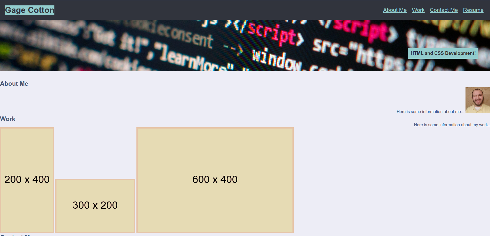
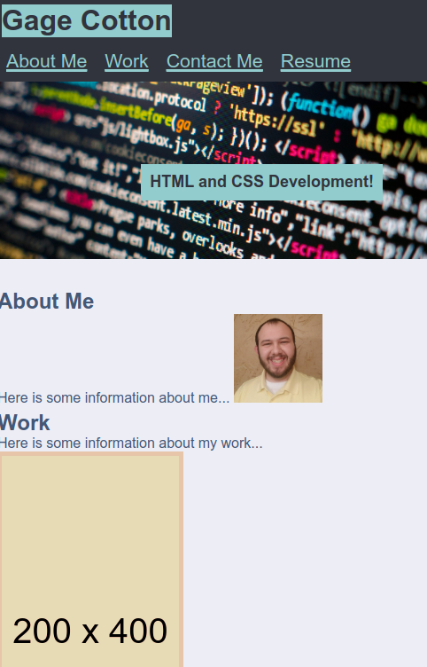

# Portfolio Project

## Description

Provide a short description explaining the what, why, and how of your project. Use the following questions as a guide:
My motivation is to show off my skills as a potential asset to a future employer. It shows off all of the web applications that I have created previously while showing of skills while developing this webpage. It organizes everything neatly, allows for easy navigation of my previous works while demonstrating HTML and CSS skills. I learned how to align elements to the end of flexboxes, using IDs to have anchors point to certain parts of a webpage, and practice using hover over images.

